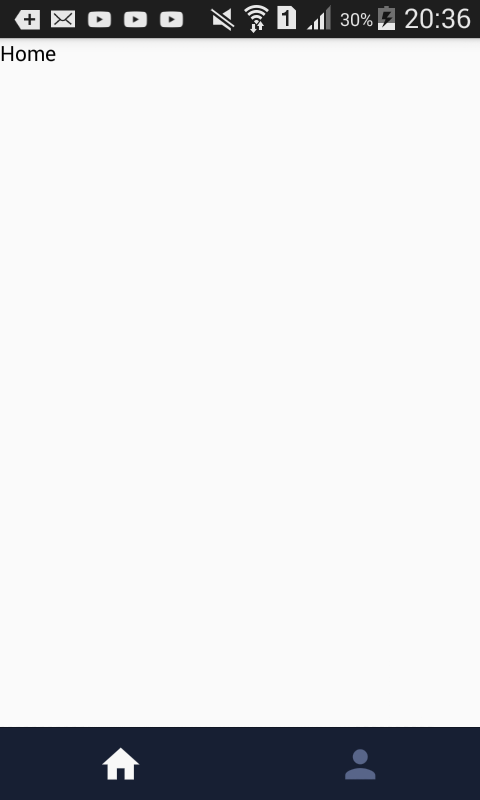

# Langkah-Langkah Membuat Tab Bar Bottom On React Native



## Package yang diperlukan

- React Navigation
- React Native Elements
- React Native Vector Icons

## Langkah-Langkah Pengerjaan

1. Install Package React Navigation

```
$ npm install --save react-navigation
```

Terkadang package `react-navigation` terbaru mengalami error/ bug , maka saya menggunakan alternative package `react-navigation` versi 2.18.2

```
$ npm install --save react-navigation@^2.18.2
```

2. Install Package React Native Elements

```
$ npm i react-native-elements --save
```
3. Install Package React Native Vector Icons

```
$ npm i --save react-native-vector-icons
```

3. Link Package
```
$ react-native link react-native-vector-icons
```

4. Source Code `App.js`
```
import React from 'react'
import { Stack } from './src/routes/router';
Stack

class App extends React.Component{
  render(){
    return(
      <Stack/>
    )
  }
}
export default App 
```

5. Source Code `src/screen/Home.js`
```
import React from 'react'
import {View,Text} from 'react-native'

class Home extends React.Component{
  render(){
    return(
      <View>
        <Text> Home</Text>
      </View>
    )
  }
}
export default Home 
```

6. Source Code `src/screen/Profile.js`
```
import React from 'react'
import {View,Text} from 'react-native'

class Home extends React.Component{
  render(){
    return(
      <View>
        <Text> Profile</Text>
      </View>
    )
  }
}
export default Home 
```

7. Source Code `src/routes/router.js`

```
import React from 'react'
import { Icon } from 'react-native-elements'
import { createBottomTabNavigator } from 'react-navigation'
import Home from '../screen/Home';
import Profile from '../screen/Profile';


export const Stack = createBottomTabNavigator(
    {
        Home: {
            screen: Home,
            navigationOptions: () => ({
                tabBarIcon: ({ tintColor }) => (
                    <Icon
                        name="home"
                        color={tintColor}
                        size={30}
                    />
                )
            })
        },
        Profile: {
            screen: Profile,
            navigationOptions: () => ({
                tabBarIcon: ({ tintColor }) => (
                    <Icon
                        name="person"
                        color={tintColor}
                        size={30}
                    />
                )
            })
        }
    },
    {
        tabBarOptions: {
            showLabel: false, // hide labels
            activeTintColor: '#F8F8F8', // active icon color
            inactiveTintColor: '#586589',  // inactive icon color
            style: {
                backgroundColor: '#171F33' // TabBar background
            }
        }
    }
)


```